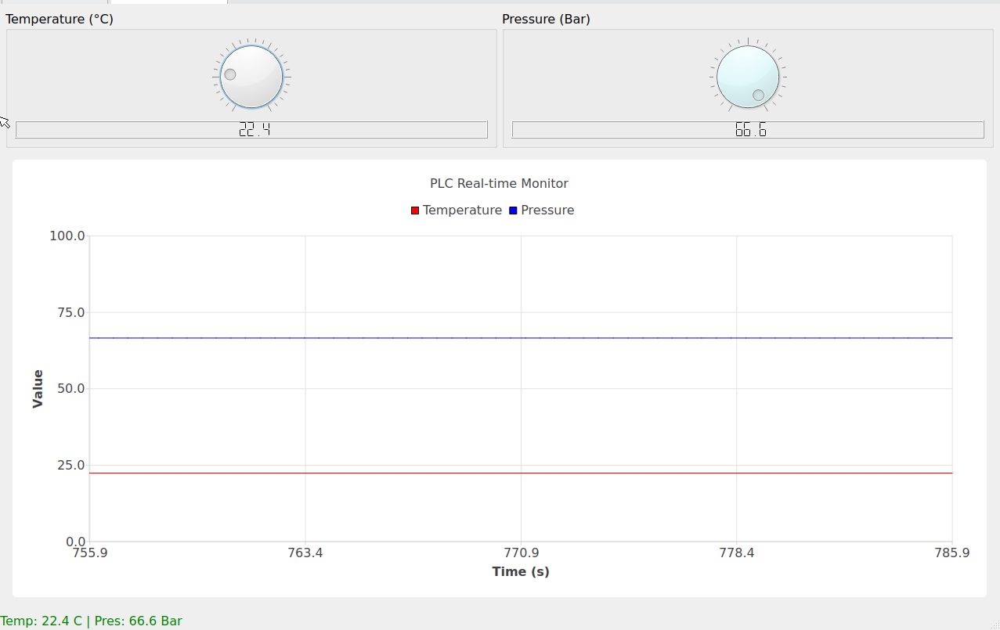

# Industrial PLC Monitor v1.1 (Qt6 + libmodbus)

[](LICENSE)
[](https://www.qt.io/)
[](https://en.cppreference.com/w/cpp/17)

这是一个高性能的轻量级工业 PLC 监控工具，基于 **C++17** 和 **Qt6** 开发。它能够通过 **Modbus TCP** 协议实时采集 PLC 的传感器数据（温度、压力），并在界面上进行可视化展示（仪表盘、实时曲线），同时将数据自动记录到 SQLite 数据。

## ✨ 主要功能

*   **数据采集**:
    *   **PLC 数据**: 使用 `libmodbus` 库通过 TCP/IP 读取 温度 (Temperature) 和压力 (Pressure) 寄存器。
*   **多线程架构**:
    *   数据采集运行在独立线程中，确保 UI 界面流畅不卡顿。
*   **可视化仪表盘**:
    *   双仪表盘设计 (Dial + LCD) 分别显示温度和压力。
*   **实时趋势图**:
    *   使用 Qt Charts 绘制双曲线（红色：温度，蓝色：压力）。
    *   支持动态 X 轴滚动。
*   **数据持久化**:
    *   内置 SQLite 数据库，自动创建 `plc_logs` 表记录历史数据。
*   **双模式运行**:
    *   **默认模拟模式**: 无需硬件即可运行，自动生成模拟波形数据。
    *   **真实连接模式**: 指定 IP 后自动切换为 Modbus TCP Client。
*   **嵌入式支持**:
    *   支持 Linux Framebuffer (`linuxfb`)，适合无桌面环境的工控机。

## 🛠️ 依赖环境

在编译之前，请确保系统（Ubuntu 20.04/22.04/24.04）已安装以下依赖：

*   **C++ Compiler**: 支持 C++17 (GCC/Clang)
*   **CMake**: >= 3.16
*   **Qt6**: Core, Gui, Widgets, Charts, Sql
*   **libmodbus**: 工业 Modbus 通讯库

### 快速安装依赖 (Ubuntu/Debian)

```bash
sudo apt update
sudo apt install build-essential cmake
# 安装 Qt6 及其图表模块
sudo apt install qt6-base-dev libqt6charts6-dev qt6-base-private-dev
# 安装 libmodbus
sudo apt install libmodbus-dev libmodbus5
```

## 🚀 编译指南

1.  **克隆项目**
    ```bash
    git clone https://github.com/aaaasssacs1/finalhomework.git
    cd finalhomework
    ```

2.  **构建项目**
    ```bash
    mkdir build && cd build
    cmake .. && make
    ```

3.  **运行**
    编译成功后，将在 `build` 目录下生成可执行文件 `PlcMonitor`。

## 📖 运行说明

运行截图：



### 1. 模拟模式 (默认)
直接运行程序，无需 PLC 硬件。程序会生成随机的温度、压力数据和 CPU 负载演示。
```bash
./PlcMonitor
```
*或者明确指定:*
```bash
./PlcMonitor --sim
```

### 2. 真实 PLC 连接
只需在命令行后跟上 PLC 的 IP 地址，程序会自动切换到真实 Modbus 模式。
```bash
# 连接到默认端口 502
./PlcMonitor 192.168.1.10

# 连接到指定端口
./PlcMonitor 192.168.1.10:1502
```

### 3. 嵌入式/无桌面模式 (Linux Framebuffer)
在没有 X11 或 Wayland 的纯终端环境下（如树莓派、工控机），使用 `-platform linuxfb` 参数直接输出图像到屏幕。
```bash
# 模拟模式 + Framebuffer
./PlcMonitor -platform linuxfb

# 真实连接 + Framebuffer
./PlcMonitor 192.168.1.50 -platform linuxfb
```

## 🔌 Modbus 协议定义

在真实模式下，程序默认配置如下：

*   **Protocol**: Modbus TCP
*   **Slave ID**: 1
*   **Function Code**: 03 (Read Holding Registers)
*   **Start Address**: 0 (对应 PLC 地址 40001)
*   **Register Count**: 2

| 偏移地址 | 数据类型 | 描述 | 单位 | 缩放比例 |
| :--- | :--- | :--- | :--- | :--- |
| `0x00` | UINT16 | 温度 (Temperature) | °C  | value / 10.0 |
| `0x01` | UINT16 | 压力 (Pressure)    | Bar | value / 10.0 |

> **注意**: 程序会将读取到的整数除以 10.0 进行显示。例如 PLC 发送 `255`，界面显示 `25.5`。

## 📂 项目结构

```text
PlcMonitor/
├── CMakeLists.txt       # CMake 构建脚本
├── include/             # 头文件
│   ├── DbManager.h      # SQLite 数据库管理
│   ├── MainWindow.h     # 主界面 UI 逻辑
│   └── ModbusWorker.h   # Modbus 通讯工作线程
├── src/                 # 源文件
│   ├── main.cpp         # 程序入口与参数解析
│   ├── DbManager.cpp    # 数据库 CRUD 实现
│   ├── MainWindow.cpp   # 界面布局与图表绘制
│   └── ModbusWorker.cpp # Modbus 读写与自动重连逻辑
└── README.md            # 项目文档
```

## 📝 数据库说明

程序首次运行会自动在运行目录生成 `plc_data.db`。

**表结构 (`plc_logs`)**:

| 字段名 | 类型 | 描述 |
| :--- | :--- | :--- |
| `id` | INTEGER PK | 自增主键 |
| `timestamp` | DATETIME | 记录时间 |
| `temperature` | REAL | 温度值 |
| `pressure` | REAL | 压力值 |

## ⚠️ 常见问题

1.  **Connection Refused**:
    *   如果在真实模式下报错，说明无法连接到目标 IP。请检查网络连通性或 PLC 是否开启。
    *   如果没有 PLC，请不要加 IP 参数，直接运行 `./PlcMonitor` 进入模拟模式。

2.  **Permission denied (/dev/fb0)**:
    *   使用 `linuxfb` 时，如果提示权限不足，请使用 `sudo ./PlcMonitor ...` 或将用户加入 `video` 组。

3.  **undefined reference to ...**:
    *   如果修改了头文件的信号/槽，记得重新运行 `cmake ..` 以触发 Qt MOC 的重新生成。

## License

本项目仅供学习与演示使用。
